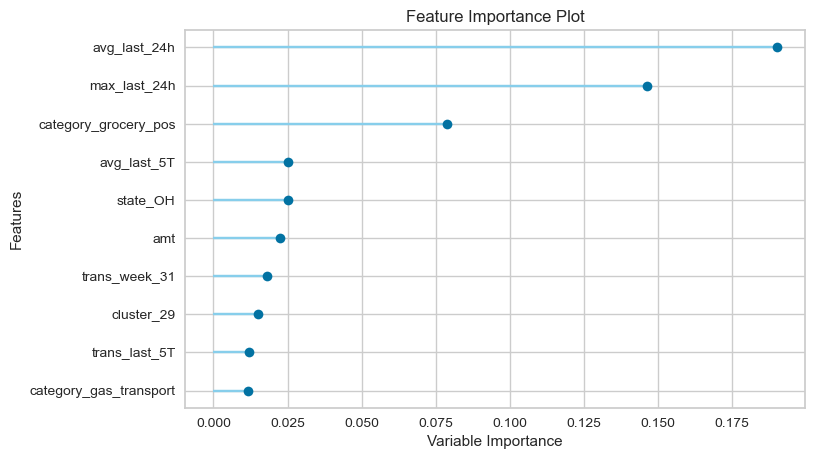
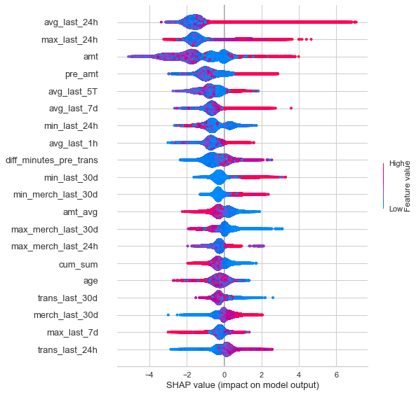

#  Capstone Project: Credit Card Fraud Detection Model

Author: Vincent Chua

### Table of Contents

* [Problem Statement](#Problem-Statement)
* [Executive Summary](#Executive-Summary)
* [Datasets](#Datasets)
* [Data Dictionary](#Data-Dictionary)
* [Conclusions and Recommendations](#Conclusions-and-Recommendations)

### Problem Statement

One of the main business of the bank is to provide Credit Card facility for the clients. However, Credit Card Fraud Cases does not seems to decrease along with the evolving of technologies these years. It has caused significant losses and negative impact to the clients as well as the bank. For clients, not every credit card fraud transactions have been realized on time or there are clients who do not aware of the fraud transactions occurred as the amount of the fraud transactions are too little to be realized. Hence these group of clients may not raise the discrepancies on time for the bank the to investigate and reimburse the losses. Most of the time if the bank's investigation outcome is a fraud transaction, the bank has to reimburse the clients and it causes the bank suffer losses. On top of that, clients may also lose confident on the bank's products and it will further causes the reputational loses to the bank.

With above, Risk and Compliance department has approached me who is a data scientist of the bank to build an effective __Fraud Detection Model__ which able to classify the fraud transactions accurately. I have been provided with 1.3m of training datasets and 550k testing datasets with transactions from duration 1st Jan 2019 - 31st Dec 2020. It covers credit cards of 1000 customers doing transactions with a pool of 800 merchants. I will also need to __identify the top predictors and features__ that used to detect the credit card fraud transactions.

By having the fraud detection model, the team will be able to identify the fraud transaction right immediately when it being detected. It will reduce the bank's losses incurred in credit card fraud transactions, gain the reputation on non-compromise security risk and clients will not be the victims of the fraud transactions.

I decided to build the fraud detection classification model by exploring the classification algorithms, for example `LogisticRegression`, `GaussianNaiveBayes`,`RandomForestClassifier`, `LGBMClassifier`, `XGBClassifier` and `CatBoostClassifier`. I will also conduct the __*Recency, Frequency, Monetary Value (RFM) Analysis for customer segmentation*__ and __*build a Tableau Dashboard to visualize the predicted outcome from test dataset*__.

The datasets provided is a super imbalanced in class which only 0.58% of data are labelled as fraud transactions, which means that high accuracy will not be the metric suitable in evaluating this datasets. I will need to have high True Positive outcome with minimal False Negative (Predicted not fraud, but is true fraud) and False Positive (Predicted is fraud, but is not fraud). In this case, my priority metrics to evaluate success of my model is to have __High Recall score__ and __High F1 Score__ which balance it with __Precision Score__. Specifically with the score above 90%. My model have to be able to capture as high numbers of fraud transactions as possible, and it allow minimal of Type I error (False Positive), this is because too many of Type I error may cause unnecessary alert triggered to clients as well as creating inconveniences.

---

### Executive Summary

With the evolving of the internet and popularity in using credit card for payments, numbers of credit card fraud has been increased as compared to old days. Although there is very low crime rate in Singapore, there is still credit card fraud cases happens and it affect the credit card users as well as the bank who provide the credit card facilities. Nowadays, the news about credit card fraud transactions may getting more frequently that both regulators and public getting more cautions and seriously look into it. According to [Straits Times](https://www.straitstimes.com/singapore/460-jump-in-unauthorised-online-banking-and-card-transactions-in-2020), there were 1,848 police reports of such transactions involving criminals phishing for banking and card details from victims - up 462 per cent from 2019's 329 cases.

Many banks have taken up precautionary actions by implementing stringent SMS one-time passwords (OTP) requirements as well as sending transaction alerts to the user in order to prevent credit card fraud to happens. However, with the evolving in technologies fraudsters will keep come up with new ways to commit credit card fraud, hence we have to keep on modify and improve our detection model in order to detect credit card fraud as accurate as possible along the way.

This project aim to build a Classification Model and our final model will be able to detect Fraud transactions from the credit card transactions. The effective model will allow the bank to detect the fraud transactions on time in order to prevent huge losses caused by the fraudsters. It will also triggered the alert to cardholder immediately after the fraud transaction been detected. Eventually it will boost up cardholder's trust on the bank with all the security and precautionary measures takes place to protect cardholder's interest. Besides that, the project also identify Top 3 Predictors and important features that have impact on the target outcome. Risk and Compliance Team may take the necessary precautionary measures against these predictors and features.

I split the train dataset into train and validation datasets, then I decided to built both hand-made ML Model and AutoML model in this project. Firstly, I build the classification model based on selected algorithms __(LogisticRegression, GaussianNaiveBayes,RandomForestClassifier, LGBMClassifier, XGBClassifier and CatBoostClassifier)__. Next, I proceed to identify the top 2 models (XGBClassifier and CatBoostClassifier) from these algorithms and use the PyCaret (AutoML) to decide my final model (XGBClassifier). Lastly, I used PyCaret to perform hyperparameters tuning and come out with best tuned model.

__*Hand-Made Model Results (Sorted by F1 Score & Recall Score):*__

|model|train accuracy|	test accuracy| precision|	recall|	average precision|	f1_score|	roc_auc|
|---|---|---|---|---|---|---|---|
|CatBoostClassifier|	0.999987|	0.999429|	0.983982|	0.916356|	0.902162|	0.948966|	0.999736|
|XGBClassifier|	0.999969|	0.999374|	0.982699|	0.907832|	0.892659|	0.943783|	0.999546|
|Random Forest Classifier|	1.000000|	0.998760|	0.985517|	0.797549|	0.787170|	0.881625|	0.995251|
|Logistic Regression|	0.997269|	0.997082|	0.887594|	0.567928|	0.506591|	0.692658|	0.979961|
|LGBMClassifier|	0.987712|	0.986825|	0.281170|	0.819393|	0.231434|	0.418674|	0.947420|
|Gaussian Naive Bayes|	0.979104|	0.978863|	0.181049|	0.752264|	0.137631|	0.291856|	0.947807|

From model results, my baseline model - LogisticRegression provided F1 Score 69.3% and Recall Score of 56.8%. I then selected the top 2 models CatBoostClassifier with F1 Score of 94.9% and Recall Score of 91.6% and XGBClassifier with F1 Score of 94.4% and Recall Score of 90.8%. These are the only 2 models that have all 3 metrics (F1 Recall Precision Score) above 90%, hence I retrained the models using PyCaret. Instead of remove the multicollinearity by myself, PyCaret take care of this by itself and the results show XGBClassifier perform better than CatBoostClassifier. XGBClassifier manage to get 94.5% F1 Score, 91.4% Recall Score and 97.8% Precision Score. After hyperparameters tuning, my best tuned model provide 95.05% F1 Score, 93.6% Recall Score and 96.5% Precision Score.

__*AutoML Model Results (Sorted by F1 Score):*__

|Model	|Accuracy	|AUC	|Recall	|Prec.	|F1	|Kappa	|MCC	|
|---|---|---|---|---|---|---|---|
|__xgboost__	Extreme Gradient Boosting|	0.9994|	0.9996|	0.9142|	0.9782|	0.9451|	0.9448|	0.9453|
|__catboost__	CatBoost Classifier|	0.9992|	0.9992|	0.8922|	0.9737|	0.9311|	0.9307|	0.9316|

|Model	|Accuracy	|AUC	|Recall	|Prec.	|F1	|Kappa	|MCC	|
|---|---|---|---|---|---|---|---|
|xgboost (tuned)| 0.9994|	0.9997|	0.9400|	0.9561|	0.9479|	0.9476|	0.9477|

Risk and Compliance team can refer the top predictors and features effect from plot and summary chart below. The team can also monitor the credit card transactions via __Credit Card Monitoring Dashboard__ at [Tableau Public](https://public.tableau.com/app/profile/vincent.chua/viz/frauddetection_16470019928680/Dashboard2). *(The data shows in the Dashboard is from test dataset with predicted outcome from my best tuned model)*

__Top Predictors Plot:__

__SHAP Summary of Features Effect:__

---
### Datasets

If you would like to download the codebook and run it on your machine, you will need to download the full datasets from Kaggle source at https://www.kaggle.com/kartik2112/fraud-detection and __save both csv files into `datasets` folder.__
- fraudTest.csv (150.35 MB)
- fraudTrain.csv (351.24 MB)

---
### Data Dictionary

|Feature|Dataset|Type|Description|
|---|---|---|---|
|trans_datetime|train_cleaned/test_cleaned|datetime|Credit Card trasaction date and time|
|cc_num|train_cleaned/test_cleaned|object|Credit Card Numbers|
|merchant|train_cleaned/test_cleaned|object|Credt card transaction's merchant name|
|category|train_cleaned/test_cleaned|object|Merchant's Category|
|amt|train_cleaned/test_cleaned|float|Credit Card Transaction Amount|
|gender|train_cleaned/test_cleaned|object|Gender (Male/Female)|
|street|train_cleaned/test_cleaned|object|Street of Credit Cardholder's location|
|city|train_cleaned/test_cleaned|object|City of Credit Cardholder's location|
|state|train_cleaned/test_cleaned|object|State of Credit Cardholder's location|
|zip|train_cleaned/test_cleaned|object|zip of Credit Cardholder's location|
|lat|train_cleaned/test_cleaned|float|Latitude Credit Cardholder's location|
|long|train_cleaned/test_cleaned|float|Longitude Credit Cardholder's location|
|city_pop|train_cleaned/test_cleaned|int|city population|
|job|train_cleaned/test_cleaned|object|Job Profession of Credit Cardholder|
|trans_num|train_cleaned/test_cleaned|object|Credit Card's Transaction Number|
|merch_lat|train_cleaned/test_cleaned|float|Latitude Merchant's location|
|merch_long|train_cleaned/test_cleaned|float|Longitude Merchant's location|
|is_fraud|train_cleaned/test_cleaned|int|Target Outcome(0:non-fraud, 1:fraud)|
|name|train_cleaned/test_cleaned|object|Full Name of Credit Cardholder|
|coords_ori|train_cleaned/test_cleaned|object|Combine lat & long as Credit Cardholder's coordinate|
|coords_merch|train_cleaned/test_cleaned|object|Combine merch_lat & merch_long as Merchant's coordinate|
|trans_year|train_cleaned/test_cleaned|int|Year of Credit Card Transaction is performed|
|trans_month|train_cleaned/test_cleaned|int|Month of Credit Card Transaction is performed|
|trans_week|train_cleaned/test_cleaned|int|Week of Credit Card Transaction is performed|
|trans_day|train_cleaned/test_cleaned|int|Day of Credit Card Transaction is performed|
|trans_hour|train_cleaned/test_cleaned|int|Hour of Credit Card Transaction is performed|
|trans_minute|train_cleaned/test_cleaned|int|Minute of Credit Card Transaction is performed|
|trans_dayofweek|train_cleaned/test_cleaned|int|Day of Week of Credit Card Transaction is performed|
|age|train_cleaned/test_cleaned|int|Age of Credit Cardholder as of Card Transaction is performed|
|distance|train_cleaned/test_cleaned|float|Coordinate Distance between Credit Cardholder and Merchant|

---

### Conclusions and Recommendations

*__Findings:__*

1) XGBoost is our final model that provide the highest recall score and f1-score on classified the credit card fraud transactions. It shows 94.5% in F1-score and 91.4% of Recall Score on our validation dataset. Although both f1-score and recall score decrease on our unseen test datasets, it still manage to maintain 91.6% f1-score and 90.7% recall score.

2) From EDA we found that the very_high transaction amount group has the less transaction numbers, however it have the highest fraud transaction rate than the other amount group. It is about 300 times higher than very_low transaction amount group. We also found out that the age above 73 have relatively higher fraud transaction rate as compared to age below 73, however the lowest fraud transaction rate happens in age group between 33 to 43.

3) State of AK has the highest fraud transaction rate out the rest of the state with credit card transactions 1000 and above. The lowest fraud transaction rate happens to be in state of ID. AK have about 8.5 times higher fraud transaction rate than ID.

4) From the RFM Analysis, we segmentize the customer into 5 segments which are Top_Cust, High_value_Cust, Medium_Value_cust, Low_Value_Cust and Lost_Cust. 14% of the credit cards fall under Top Cust and High Value Cust segments, while 26% of credit cards fall in the bottom segment - Lost Cust. Lost Cust also has the highest Fraud Transactions Rate (2%) among the customer segments, while the lowest Fraud Transactions Rate (0.26%) is under Top Cust segment. It means that the Lost Cust Segment have about 10 times higher chances to have fraud transaction than Top Cust Segment.

5) From our final model, we manage to identify the top predictors and features that important to detect credit card fraud transactions. The top 3 predictors are Average and Max Transaction Amount in the last 24 hours and grocery_pos Category. Besides the top 3 predictors, we also identified features that have strong effect on our target from SHAP Summary Chart. Transaction Amount, previous Transactions amount, previous transactions amount, average transaction amount in last 7 days, minimum transaction amount in last 30 days and maximum merchant transaction amount in last 30 days are the features with strong positive impact on detecting the transaction as fraud transactions.

*__Recommendations:__*

In this project, we manage to accomplish two goals that specified in our problem statement.

1) We tested our Fraud Detection Model on unseen test dataset with about 550k observations. The model achieved 99.94% of accuracy, 91.58% F1-Score, 90.7% Recall Score and Precision Score of 92.4%. This will improve the efficiency and effectiveness on fraud detection by the Risk and Compliance Team and reduce unnecessary false alarm triggered to credit card users due to Type I error. With above 90% recall score, it will also allow the bank save up huge losses from the fraud transactions.

2) The Top 3 Predictors that cause the model to detect fraud transactions are:
1. Average Transaction Amount in last 24 hours *(avg_last_24h)*
2. Maximum Transaction Amount in last 24 hours *(max_last_24h)*
3. Grocery Pos Category *(category_grocery_pos)*

The 4 features with strong effects and impact on target are:
1. Credit Card Transaction Amount *(amt)*
2. Previous/Last Credit Card Transaction Amount *(pre_amt)*
3. Average Transaction Amount in last 7 days *(avg_last_7d)*
4. Minimum Transaction Amount in last 30 days *(min_last_30d)*
5. Maximum Merchant Transaction Amount in last 30 days *(max_merch_last_7d)*

From the predictors and features above, it shows that the model is able to detect the fraud by the difference in spending behaviors and transactions amount. Which it make sense that the fraudster usually have high chance to have different spending behaviors as compared to the credit cardholder did.

3) This model have its limitation that it was build based on US States' data and it may not be able to generalized to unseen data outside the US states. Besides that, the model also detect the fraud heavily rely on the spending behaviors, it may have the limitation if the credit card has not been used at all by the original cardholder. It will not have the spending behavior record, and the model may not able to detect it accurately.

4) I have build the Credit Card Monitoring Dashboard via [Tableau Public](https://public.tableau.com/app/profile/vincent.chua/viz/frauddetection_16470019928680/Dashboard2), the Risk and Compliance Team can monitor the credit card transactions via different age groups, geographically, timeline trends, different categories and identify the predicted outcome with anomaly score shown on each individual credit card.
