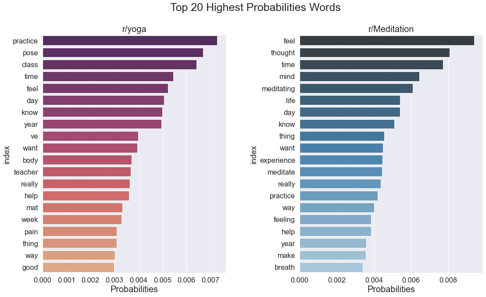

#  Project 3: Subreddit Classification with NLP

Author: Vincent Chua

### Table of Contents

* [Problem Statement](#Problem-Statement)
* [Executive Summary](#Executive-Summary)
* [Datasets](#Datasets)
* [Data Dictionary](#Data-Dictionary)
* [Conclusions and Recommendations](#Conclusions-and-Recommendations)

### Problem Statement

We are a group of data scientists that representing a yoga studio. Our stakeholder, the marketing team want to develop a marketing campaign that target on Yoga Enthusiasts to sign up membership and classes with us. Instead of going for traditional way of marketing strategies, the team approach us and seek to maximize marketing resources with the effectiveness and efficiency marketing campaigns target on Yoga Enthusiasts.

Our goal is to build an effective model that able to classify the *__yoga__* and *__non-yoga enthusiasts__* from the subreddit posts. This allow our marketing team to maximize the marketing spend to the correct target segment (yoga enthusiasts). We will also explore the differences between the subreddits (r/yoga and r/Meditation) in order to identify the Top Predictors and Trending Words for r/yoga. This is to better develop our marketing strategy, Yoga Classes and Packages.  

We decided to scrap our dataset from Reddit posts - subreddits __r/yoga__ and __r/Meditation__ which both have similar in nature. Base on the subreddits post topics (title and selftext), we will then build an effective classification model to classify the posts accurately by evaluating the models using __accuracy__, __recall__ and __f1-score__. The classification models that we will build are `Logistic Regression`, `Multinomial Naive Bayes` and `Random Forest Classifier`.

In order to evaluate success of our models, if our dataset is balanced in classes, then we will need to have high accuracy score, it means our model will have high predicted correctly outcomes out of overall predictions. However, if our dataset is imbalanced in classes, then we will need to have high f1-score which take a balance between precision and recall score. It is unrealistic to say that our model will be perfect or 100% accurate predict and generalize the datasets. Hence there will be errors (type I and type II). In this project, we can accept some type I error or False Positive, it means that predicted is yoga enthusiasts in fact is non-yoga enthusiasts. Although this is not our major target segment, there is a potential possibilities to convert this group (non-yoga enthusiasts) into dollar. On the other hand, we will need to minimize Type II error or False Negative as this means we predicted as non-yoga enthusiasts, in fact this is actual yoga enthusiasts. It means that we will miss out our target segments and we do not want our marketing spend miss out the targeted segments that highly to be converted into dollar. Hence, maximize recall score is needed in such situations.

---

### Executive Summary

Traditionally, our marketing approach on our targeted segments is (1) Need Based Approach and (2) Profilers Approach. Both approaches are good, however with the growth in the Internet and Social Media usages, people tend to access information easily and faster as compared to old days. People now getting familiar and adhere to Twitter, Facebook, Instagram, Reddit for social, posting, discussion as well as sharing thoughts. And these medias consists plenty of unstructured data eg. Images, Videos as well as text (reviews). According to [DAVID SAYCE](https://www.dsayce.com/social-media/tweets-day/) As of May 2020, Twitter every second, on average have around 6,000 tweets or, 350,000 tweets sent per minute or, 500 million tweets sent each day. Another example, according to [OBERLO](https://sg.oberlo.com/blog/reddit-statistics), Reddit have 52 million daily active users worldwide, users spend on average 10 min and 23 sec per visit on the site, there are currently more than 2.8 million subreddits and more than 130,000 active communities. With all these examples, it tell us that instead of adhere to traditional marketing approach, we can explore on more advance and scientific approach by analyzing all these data online and build a model which able to generalize for new data.

We understand that by using traditional approach, it takes a lot of time to conduct surveys and research to get the right profiles of clients or understand the market trends, hiring sales person with high commissions to conduct need based approach sales and acquire the customers. All these are challenges we are facing and will eventually lead us losing of market competitiveness if no changes made.

This project is to focus on building a text classifier to identify the posts from Reddit r/yoga and r/Meditation. From the effective model we build, we able to distinguish Yoga Enthusiasts and non-yoga Enthusiasts from the subreddit posts. It allow us to accurately classify and target on Yoga Enthusiasts. Eventually this will lead to maximize our marketing resources and convert to dollar for the company. Besides that, We also able to find out the top predictors or trending words for Yoga Enthusiasts. In other words, our effective model able to generalize for future new data and identify the top predictors and trending words in just one-click (few minutes) away. Marketing team can have significant reduction in manpower needed, money spend on surveys and researches and allocate the resources to right channel to improve company competitiveness in long run.

In order to get the sufficient datasets, we scrapped 1500 "submission" posts from each subreddit using PushiShift Reddit API.
After cleaning off the datasets, removed non-text and duplicates subreddit posts, we have total 1679 posts after combined both yoga and meditation datasets. Our text classifier focus on combination of title and selftext from subreddits. We also removed the stop words and lemmatized the text in order for better feature extraction via Count Vectorizer and TFIDF Vectorizer.

As of the date we scrapped the datasets, we did exploratory data analysis and found that r/Meditation have more text post than r/yoga. It can infer that 36.8% of r/yoga posts are non-text (eg. videos, images and etc.) while 15.9% of r/Meditation posts are non-text. r/yoga have average higher number of comments (9.35) than r/Meditation (2.69) on the subreddit post. It shows that yoga community members are more actively in engaging by commenting in subreddits than meditation community. On the other hand, we found that r/Meditation posts have higher average score from upvote system (2.36) than r/yoga (1.49), it shows that r/Meditation community members prefer using the upvote system by showing their support instead of commenting. In term of length and word count on *Title and selftext*, r/Meditation have average title length of 50.17 and average word count of 8.52, selftext length of 657.43 and word count of 122.65 which these statistics are higher than r/yoga and shows that r/Meditation community members prefer expressing themself or sharing thought in text form instead of like r/yoga non-text form.

Our baseline accuracy is 58.6% and it means that we can simply predict everything as the majority class and it will give us 58.6% accuracy. We then build 3 models from - *Logistic Regression, Multinomial Naive Bayes, Random Forest Classifier* for modeling. Eventually, Count Vectorizer with Multinomial Naive Bayes provides the less overfitting model and highest Test Accuracy (90.7%), Recall (85.2%) and F1-Score (88.3%) on classifying our target Yoga Enthusiasts correctly.

Top 20 Highest Possibilities Words from our final model:

---
### Datasets

* [`yoga_raw.csv`](../datasets/yoga_raw.csv): Raw datasets with 1500 posts scrapped from subreddit __r/yoga__
* [`meditation_raw.csv`](../datasets/meditation_raw.csv): Raw datasets with 1500 posts scrapped from subreddit __r/Meditation__
* [`yoga_medit.csv`](../datasets/yoga_medit.csv): Final dataset combine both cleaned `yoga_raw` and `meditation_raw`

---
### Data Dictionary

Base on `yoga_medit.csv` dataset:

|Feature|Type|Description|
|---|---|---|
|subreddit|object|Subreddit name (r/yoga or r/Meditation)|
|title|object|Original Title of subreddit post|
|selftext|object|Body text of the original subreddit post|
|is_self|bool|Whether or not the subreddit post is a selfpost (text-only)|
|num_comments|int|The number of comments on the subreddit post|
|created_utc|int|Time the submission was created, represented in [Unix Time](https://www.epochconverter.com/)|
|created|datetime|Date Time of subreddit post creation|
|removed_by_category|object|Subreddit post removed, deleted or reclassified by category|
|author|object|Provides an instance of Redditor|
|permalink|object|A permalink for the subreddit post|
|score|int|The number of upvotes for the subreddit post|
|upvote_ratio|float|The percentage of upvotes from all votes on the subreddit post|
|clean_title|object|Cleaned Title of subreddit post|
|clean_selftext|object|Cleaned Body text of the subreddit post|
|combine_text|object|Combination of clean_title and clean_selftext|
|lem_title|object|Lemmatized Title of subreddit post|
|lem_selftext|object|Lemmatized Body text of the subreddit post|
|lem_combine_text|object|Combination of lem_title and lem_selftext|
|title_length|int|Length of clean_title|
|title_wcount|int|Word Count of clean_title|
|selftext_length|int|Length of clean_selftext|
|selftext_wcount|int|Word Count of clean_selftext|

---

### Conclusions and Recommendations

*__Findings:__*

1) Classifying the subreddits as Yoga Enthusiasts, our best model is Multinomial Naive Bayes with Counter Vectorizer can provide 90.67% accuracy in classifying yoga or non-yoga enthusiasts. Recall score of 85.17% and F1-score of 88.34%.

2) There is a limitation on the final model we build (Multinomial Naive Bayes):

- The accuracy of the model restricted to the total numbers of 3000 posts scrapped from subreddit between from 2021-12-31 to 2021-11-07 on r/yoga and r/Meditation only. In order to test our model generalizability on new data, we need to have more data for model testing and evaluation.   
- we also added in `yoga` and `meditation` into stop words listing, it further reduce the overall accuracy score of the model.   
- The text classifier model currently build to classify on binary classes. It has not yet be able to classify multi classes.

3) From EDA, we find that yoga enthusiasts prefer to post the subreddit using non-text post for example like videos and images. While on the other hand, r/Meditation community prefer text posting and it have average longer posting in words and length as compared to r/yoga. r/yoga prefer to leave comments on the post rather than using the upvote system.

4) From our Sentiment Analysis, it revealed that both r/yoga and r/Meditation have positive sentiment in average where r/yoga have slightly higher in positive sentiment (0.401) in average as compared to r/Meditation (0.393). It also shows that the users in r/yoga community have positive sentiment towards `yoga` where we may infer that about 70% of the r/yoga community users have high willingness and acceptance on yoga and high chances to be 'Yoga Enthusiasts' that our Marketing Team can target on.  

5) We manage to identify top predictors from the text classifier model, Top 3 meaningful highest probabilities predictors are `class`, `pose` and `practice` which are all good predictors to indicate as Yoga Enthusiasts' posts. We also noticed that `mat`, `teacher`, `feel`, `body` and `pain` are in the list as well. From the Venn Diagram, we found that there was total 22 unique predictors of r/yoga, Those unique predictors with yoga poses related eg. `dog`, `hip`, `stretch`, `knee` and `leg`. Out of these unique predictors, we able to identified 2 trending words `video` and `flexibility`. There was 28 commonality predictors between subreddits that our marketing team can design a marketing strategies to target on r/Meditation community and potentially convert to dollar.

*__Recommendations:__*

Based on our text classifier model and findings from this project, we manage to accomplish the two goals specified in our problem statement:

1) Our text classifier able to achieve 90.67% accuracy, 85.17% Recall score and 88.34% of F1-score in identifying Yoga Enthusiasts from the subreddit posts. This will allow our Marketing Team to maximize the marketing resources on the correct target segment (Yoga Enthusiasts). This approach will be more efficient, effective and cost-saving as compared to traditional approach that required lot of time and manpower resources to conduct research. With the high accuracy score, our marketing resources can be maximized to spent on the right segment.

2) Our Marketing Team can develop the Marketing Strategies and yoga packages that base on our top highest probabilities words as a predictor. When targeting on Yoga Enthusiasts, the team can target on below key words:

    1. practice
    2. pose
    3. class
    4. mat
    5. teacher
    6. feel
    7. body
    8. pain

From the predictors, we understand that the majority of it was about the yoga body posture and the effect or feeling after yoga that makes the concern and challenge by yoga enthusiasts. Our Marketing Team can develop the marketing strategies that emphasize on addressing these concerns. For example we will have additional co-instructor that able to provide guidance on body posture during the class when main instructor is doing the yoga. Besides that the team can provide a Complimentary Yoga Mat for new sign up with our yoga studio.

3) Our Text Classifier Model can also identify the trending words that Marketing Team used it for improving or expanding existing product and services and develop marketing trend that factor in what is on trending. In this project we manage to identify `video` and `flexibility`. In view of COVID pandemic, Yoga Enthusiasts are looking for videos for self practicing at home and at their convenience, hence the Marketing Team can provide the package for new sign up to have the exclusive yoga videos access via website or phone app 24/7 anywhere as a member privilege. Another trending word `flexibility` are those Yoga Enthusiasts ultimately want to improve. The team also can modify the yoga class that not only targeting correct body posture, but also improving in flexibility which the key word will attract the eyeball of Yoga Enthusiasts.

*__Additional Recommendations:__*

4) Both r/yoga and r/Meditation consists of 28 commonality in predictors where the Marketing Team can also take these predictors to develop a marketing strategy that can explore new potential segment on r/Meditation users by identifying their common interest. Potentially the new segment can also be converted to join our Yoga Studio.
